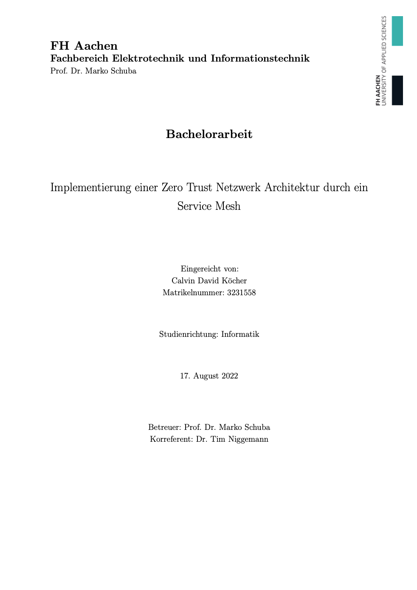
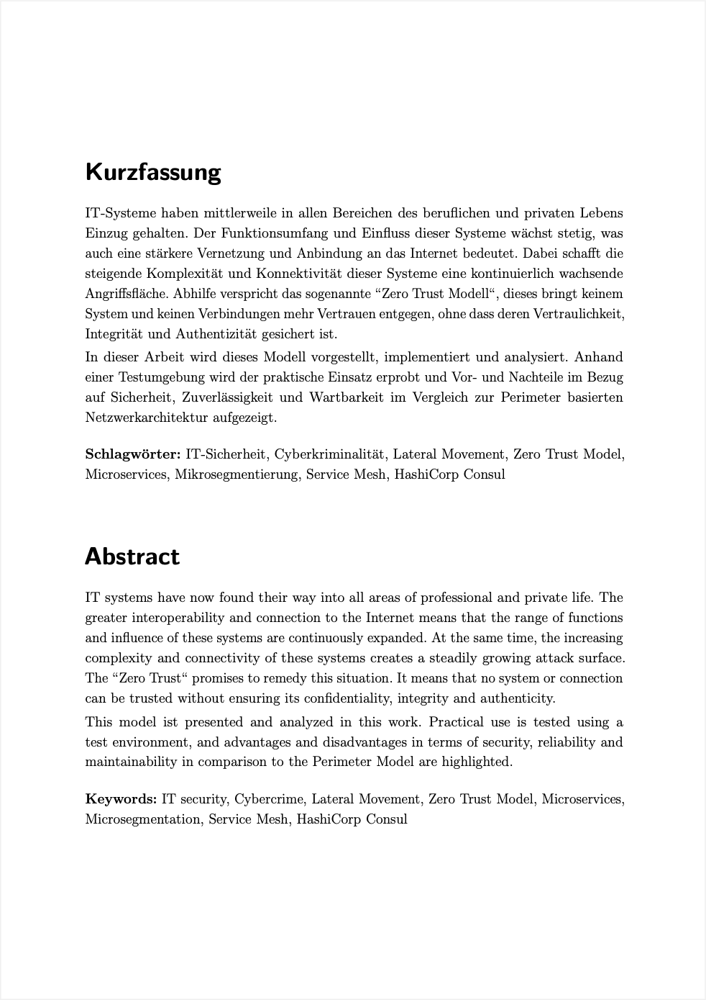
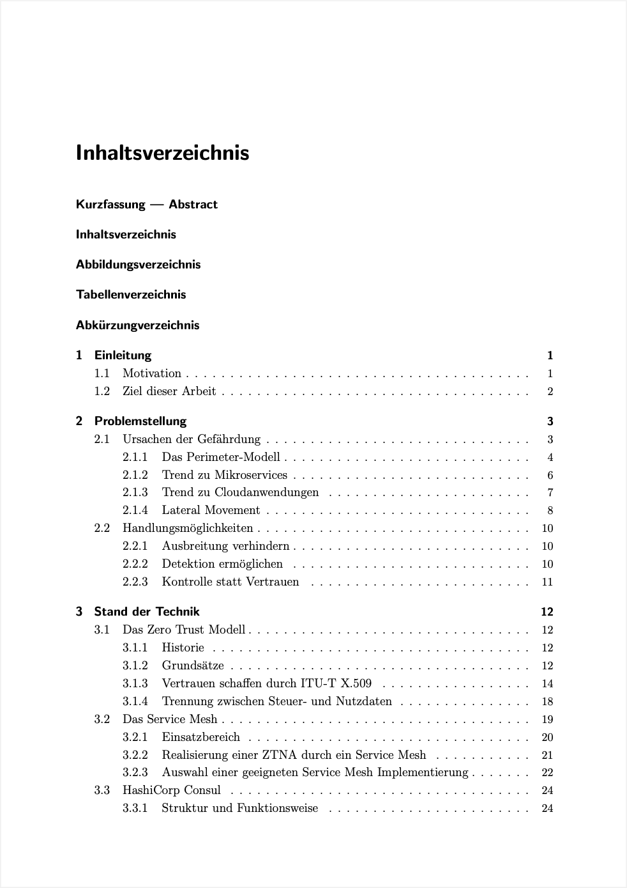
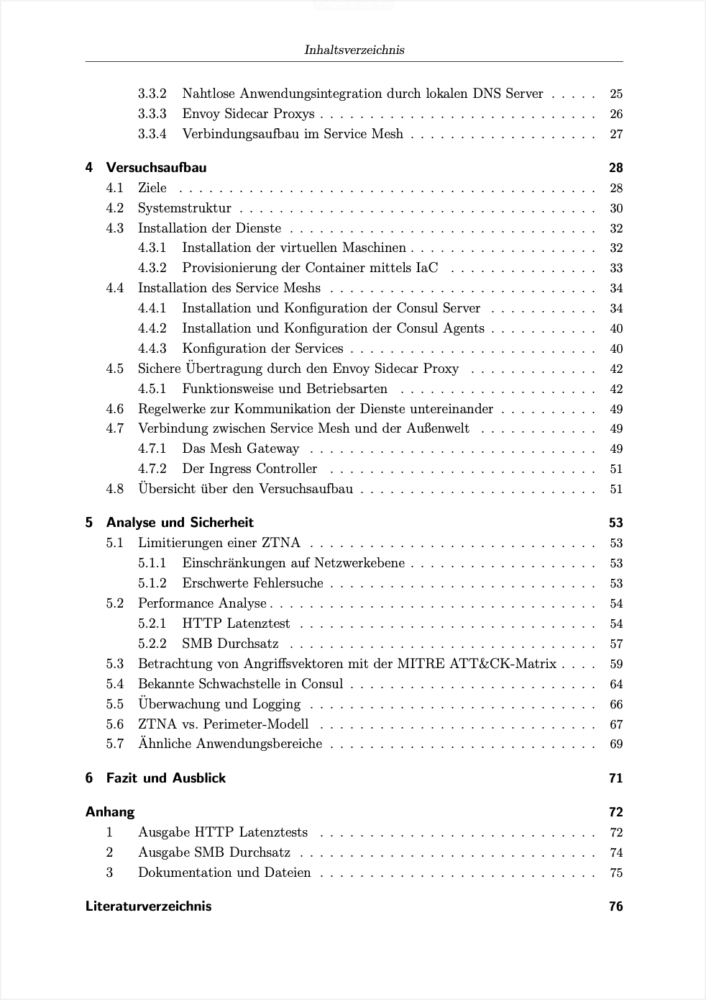

#  Bachelorarbeit Calvin David Köcher FH-Aachen
## Implementierung einer Zero Trust Netzwerk Architektur durch ein Service Mesh

<a href="Koecher_Zero_Trust_Consul.pdf">

## PDF ➡️(Koecher_Zero_Trust_Consul.pdf)
  
 </a>
